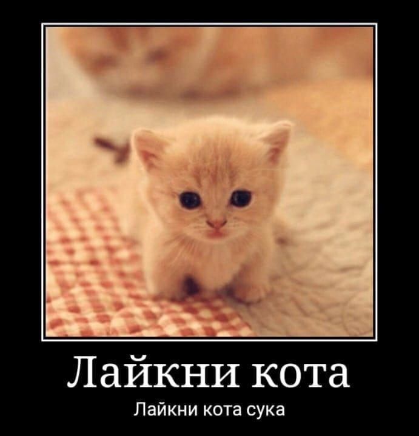

<a id="anchor"></a>

# Заголовоки
## Ещё один
### И ещё поменьше
#### Ну и так далее

---

# Разметка

просто текст
_не сутулься_
__нуб__
___ок___

    __но как__

- Список
    - Вложенный)

1. Ещё список
    1.1 Да
2. Нет

```
прикол_)
```

Термин
: почему

>я наконец-то поборол свой
>> так, а чего свой то

Снюс 1[^1] и тут же второй снсюсоид[^2]
[^1]: я кто
[^2]: я не в адеквате

---

# Таблицы

| горошек | бандюель) |
|---------|-----------|
|  почему |  горох то |
|    так  | получилось |

\# Опа обманочка)

---

# Ссылки / Картинки

[Обычная ссылка](https://vk.com)
просто котик)

крутой котик)
[](https://vk.com)

---

# я вообще психопат

<style>
    .grid {
        display: grid;
        grid-template: repeat(3, minmax(150px, auto)) / repeat(3, minmax(150px, auto));
        grid-gap: 50px;
        justify-content: center;
    }
    .grid__item {
        border: 10px solid black;
        border-radius: 20px;
        display: flex;
        justify-content: center;
        align-items: center;
        font-size: 30px;
    }
</style>

<div class="grid">
    <div class="grid__item">1</div>
    <div class="grid__item">2</div>
    <div class="grid__item">3</div>
    <div class="grid__item">4</div>
    <div class="grid__item">5</div>
    <div class="grid__item">6</div>
    <div class="grid__item">7</div>
    <div class="grid__item">8</div>
    <div class="grid__item">9</div>
</div>

[якорь](#anchor)
а где вода